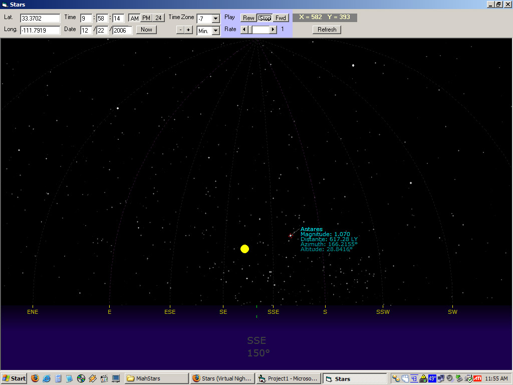



## Stars \(Virtual Night Sky\)

### Description

Enter your longitude and latitude and the program will display the positions of all the stars in the sky as viewed from your location. Place the cursor over a star to get more information. Click on the picture window and press the right and left arrow keys to move one degree in that direction. Hold Shift to move five degrees and Ctrl to move a quarter degree.

Obviously, there's a lot more that could be added to this program (saving your location, for example) but it works as is and I've gotten a little tired of messing with it. :) Feel free to make additions to it. Also, comments and votes are welcome. Thanks!
 
### More Info
 

             |
---                |---
**Submitted On**   |2006-12-22 11:52:52
**By**             |[Jeremiah Hughes](https://github.com/Planet-Source-Code/PSCIndex/blob/master/ByAuthor/jeremiah-hughes.md)
**Level**          |Advanced
**User Rating**    |5.0 (129 globes from 26 users)
**Compatibility**  |VB 6\.0
**Category**       |[Complete Applications](https://github.com/Planet-Source-Code/PSCIndex/blob/master/ByCategory/complete-applications__1-27.md)
**World**          |[Visual Basic](https://github.com/Planet-Source-Code/PSCIndex/blob/master/ByWorld/visual-basic.md)
**Archive File**   |[Stars\_\(Vir20389112222006\.zip](https://github.com/Planet-Source-Code/jeremiah-hughes-stars-virtual-night-sky__1-67371/archive/master.zip)

